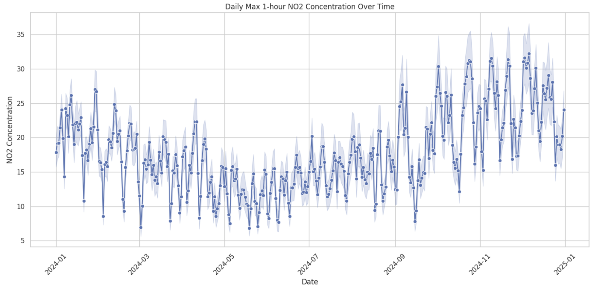

# Python 

### Dataset/Data Sources 
-  Environmental Dataset
- Breast Cancer Dataset

### Statistical tests
- They evaluate whether data patterns are meaningful or merely the result of random chance. 
- They work by establishing a null hypothesis (\(H_{0}\)) of no effect and computing a p-value.
- A p-value below a chosen significance threshold (typically \(\alpha = 0.05\)) rejects \(H_{0}\), indicating statistically significant findings

### Core Python Ecosystem for Testing
- Python relies on three specialized open-source libraries to execute these tests:

#### scipy.stats:
- The primary engine for traditional hypothesis testing, probability distributions, and descriptive calculations.

#### statsmodels: 
- Focused on comprehensive statistical modeling, providing in-depth regression diagnostics, generalized linear models (GLMs), and time-series tests.

#### pingouin:
- A user-friendly, high-level package that extends scipy by automatically appending statistical power, confidence intervals, and effect sizes directly into Pandas DataFrame

| Test Category | Purpose | Assumed Constraints | Python Method |
|---|---|---|---|
| Shapiro-Wilk | Evaluates whether a sample is normally distributed. | Continuous numeric metrics. | scipy.stats.shapiro |
| Independent t-test | Compares means across two completely distinct groups. | Normally distributed continuous variables. | scipy.stats.ttest_ind |
| Paired t-test | Compares group means across matched or repeated intervals. | Paired numeric observations from one entity type. | scipy.stats.ttest_rel |
| Mann-Whitney U | Compares rankings between two independent populations. | Non-parametric (does not assume normal distribution). | scipy.stats.mannwhitneyu |
| One-Way ANOVA | Compares means across three or more unique groups. | Normally distributed metrics with equal variances. | scipy.stats.f_oneway |
| Chi-Square ($\chi^{2}$) | Tests independence between structural categorical fields. | Frequency cell counts exceed minimum thresholds. | scipy.stats.chi2_contingency |
| Pearson Correlation | Measures strength of a linear relationship between two variables. | Normally distributed continuous values. | scipy.stats.pearsonr |
| Spearman Correlation | Measures a monotonic relationship between two variables. | Non-parametric, ordinal, or non-linear continuous data. | scipy.stats.spearmanr |

| Regression Test / Model | Purpose | Assumed Constraints | Python Method |
|---|---|---|---|
| Simple Linear Regression | Models relationship between one predictor and one dependent variable. | Linearity, homoscedasticity, independent and normal residuals. | statsmodels.api.OLS |
| Multiple Linear Regression | Predicts a continuous outcome using multiple explanatory variables. | No severe multicollinearity among predictor variables. | statsmodels.formula.api.ols |
| Logistic Regression | Predicts the probability of a binary or categorical outcome. | Independence of errors, absence of high multicollinearity. | statsmodels.api.Logit / Logit.from_formula |

